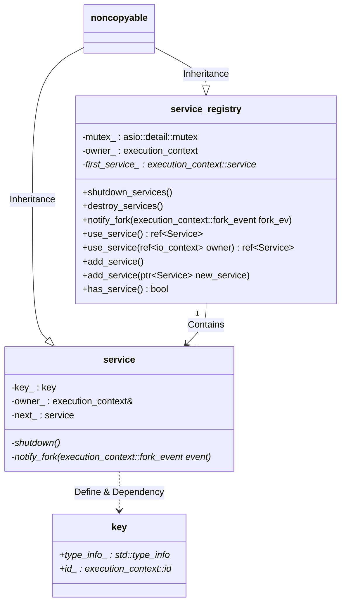

# service_registry 类代码阅读

## Related Files

```bash
asio\include\asio\detail\service_registry.hpp
asio\include\asio\detail\impl\service_registry.hpp
asio\include\asio\detail\impl\service_registry.ipp
```

## Namespace

```c++
namespace asio::detail;
```

## Description

This class seams to be the container used by **execution_context** to store **execution_context::service**. The container itself is implemented by a linked list

## Private Data

```c++
// Mutex to protect access to internal data.
mutable asio::detail::mutex mutex_;

// The owner of this service registry and the services it contains.
execution_context& owner_;

// The first service in the list of contained services.
execution_context::service* first_service_;
```
## Constructor & Destroyer

```c++
// Constructor.
ASIO_DECL service_registry(execution_context& owner);

// Destructor.
ASIO_DECL ~service_registry();
```
**Constructor:** 

```c++
service_registry::service_registry(execution_context& owner)
  : owner_(owner),
    first_service_(0)
{
}
```
Initializing owner and first_service_(may be the entry of the linked list) fields

**Destroyer:**

```c++
service_registry::~service_registry()
{
}
```

Did nothing.

## Member Functions
### **shutdown_services**

```c++
// Shutdown all services.
ASIO_DECL void shutdown_services();
```

```c++
void service_registry::shutdown_services()
{
    execution_context::service* service = first_service_;
    while (service)
    {
        service->shutdown();
        service = service->next_;
    }
}
```
Iterating all services in the linked list and call the **shutdown** member function of **execution_context::service** to execute the ***shutdown*** operation.

### **destroy_services**

```c++
// Destroy all services.
ASIO_DECL void destroy_services();
```

```c++
void service_registry::destroy_services()
{
  while (first_service_)
  {
    execution_context::service* next_service = first_service_->next_;
    destroy(first_service_);
    first_service_ = next_service;
  }
}
```

Iterating all services in the linked list and call **destroy**(actually calling the **delete** operator) function to release the service object. After each iteration, the function will update the **first_service_** private field and the entire link list will be clear eventually.

### **notify_fork**

```c++
// Notify all services of a fork event.
ASIO_DECL void notify_fork(execution_context::fork_event fork_ev);
```
```c++
void service_registry::notify_fork(execution_context::fork_event fork_ev)
{
    // Make a copy of all of the services while holding the lock. We don't want
    // to hold the lock while calling into each service, as it may try to call
    // back into this class.
    std::vector<execution_context::service*> services;
    {
        asio::detail::mutex::scoped_lock lock(mutex_);
        execution_context::service* service = first_service_;
        while (service)
        {
            services.push_back(service);
            service = service->next_;
        }
    }

    // If processing the fork_prepare event, we want to go in reverse order of
    // service registration, which happens to be the existing order of the
    // services in the vector. For the other events we want to go in the other
    // direction.
    std::size_t num_services = services.size();
    if (fork_ev == execution_context::fork_prepare)
        for (std::size_t i = 0; i < num_services; ++i)
            services[i]->notify_fork(fork_ev);
    else
        for (std::size_t i = num_services; i > 0; --i)
            services[i - 1]->notify_fork(fork_ev);
}
```
This function will iterate all the services in the linked list the notify each of them by the ***fork_event***, and it has some *"iteration order tricky"* in different event cases(*I still don't understand the purpose of this*). And it also has a *"locking tricky"* before the iteration.(*The purpose of it may be to avoid locking recursively in my opinion*)

### **use_service**

```c++
// Get the service object corresponding to the specified service type. Will
// create a new service object automatically if no such object already
// exists. Ownership of the service object is not transferred to the caller.
template <typename Service>
Service& use_service();

// Get the service object corresponding to the specified service type. Will
// create a new service object automatically if no such object already
// exists. Ownership of the service object is not transferred to the caller.
// This overload is used for backwards compatibility with services that
// inherit from io_context::service.
template <typename Service>
Service& use_service(io_context& owner);
```
Implementation:
```c++
template <typename Service>
Service& service_registry::use_service()
{
    execution_context::service::key key;
    init_key<Service>(key, 0);
    factory_type factory = &service_registry::create<Service, execution_context>;
    return *static_cast<Service*>(do_use_service(key, factory, &owner_));
}

template <typename Service>
Service& service_registry::use_service(io_context& owner)
{
    execution_context::service::key key;
    init_key<Service>(key, 0);
    factory_type factory = &service_registry::create<Service, io_context>;
    return *static_cast<Service*>(do_use_service(key, factory, &owner));
}
```

This two function use template function ***init_key*** to initialize a unique *key* value to identify a particular *Service* type. As for how it is implemented, I will explain in detail later in next section.
Then the functions call ***do_use_service*** to create the Service and add it to the linked list if there has not been a same type of *Service*(key is not matched) added in the linked list.

### **init_key**

There are two versions of ***init_key*** function implementation. The function use **typeid**(the c++ rtti feature) as *service_key* to distinguish different type of service if the **ASIO_NO_TYPEID** macro is defined. Otherwise, it use the address of a static field that is bind the  Service type as *service_key*

version 1:
```c++
#if !defined(ASIO_NO_TYPEID)
template <typename Service>
void service_registry::init_key(execution_context::service::key& key,
    typename enable_if<
      is_base_of<typename Service::key_type, Service>::value>::type*)
{
  key.type_info_ = &typeid(typeid_wrapper<Service>);
  key.id_ = 0;
}

template <typename Service>
void service_registry::init_key_from_id(execution_context::service::key& key,
    const service_id<Service>& /*id*/)
{
  key.type_info_ = &typeid(typeid_wrapper<Service>);
  key.id_ = 0;
}
#endif // !defined(ASIO_NO_TYPEID)
```
version 2:
```c++
void service_registry::init_key_from_id(execution_context::service::key& key,
    const execution_context::id& id)
{
  key.type_info_ = 0;
  key.id_ = &id;
}
```

### add_service 
```c++
  // Add a service object. Throws on error, in which case ownership of the
  // object is retained by the caller.
  template <typename Service>
  void add_service(Service* new_service);
```
Implementation:
```c++
template <typename Service>
void service_registry::add_service(Service* new_service)
{
  execution_context::service::key key;
  init_key<Service>(key, 0);
  return do_add_service(key, new_service);
}
```
The ***do_add_service*** function process the operations.
```c++
void service_registry::do_add_service(
    const execution_context::service::key& key,
    execution_context::service* new_service)
{
  if (&owner_ != &new_service->context())
    asio::detail::throw_exception(invalid_service_owner());

  asio::detail::mutex::scoped_lock lock(mutex_);

  // Check if there is an existing service object with the given key.
  execution_context::service* service = first_service_;
  while (service)
  {
    if (keys_match(service->key_, key))
      asio::detail::throw_exception(service_already_exists());
    service = service->next_;
  }

  // Take ownership of the service object.
  new_service->key_ = key;
  new_service->next_ = first_service_;
  first_service_ = new_service;
}
```

This function just do some checking and add a pre-allocated and pre-initialized Service object to the linked list.

### **has_service**
```c++
  // Check whether a service object of the specified type already exists.
  template <typename Service>
  bool has_service() const;
```

This function need no more explain.


## Graph


