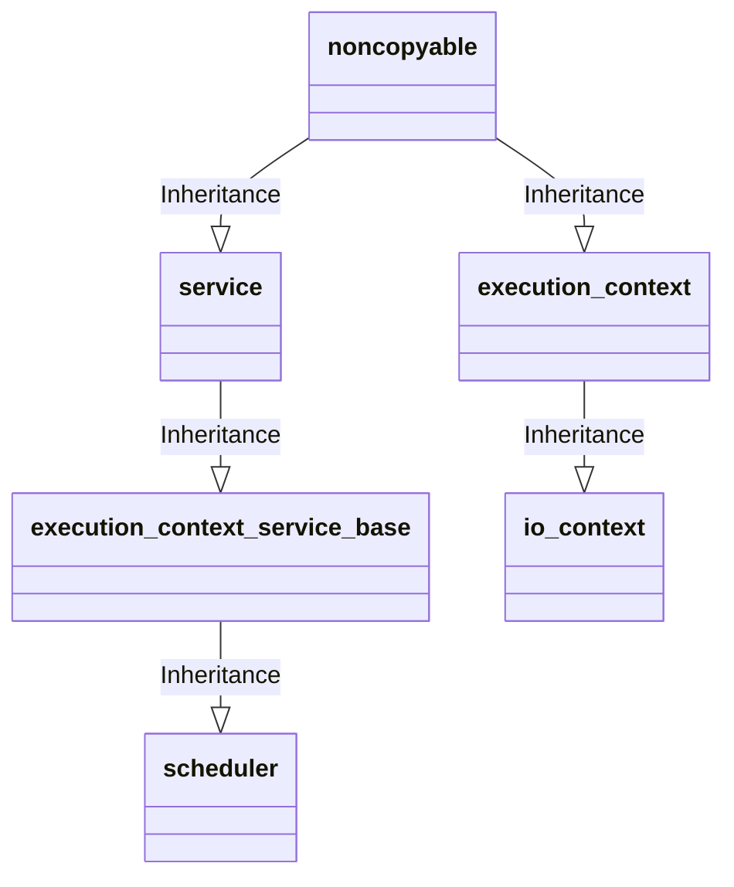
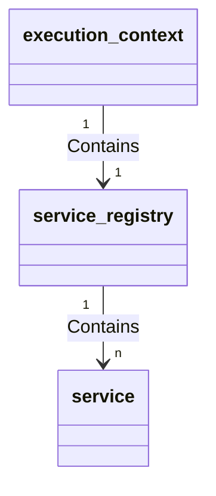

# io_context 类代码阅读
## Related Files

```bash
asio\include\asio\io_context.hpp
asio\include\asio\impl\io_context.hpp
asio\include\asio\impl\io_context.ipp
```

## Namespace

```cpp
namespace asio;
namespace asio::detail
```

## Description

```c++
/// Provides core I/O functionality.
/**
 * The io_context class provides the core I/O functionality for users of the
 * asynchronous I/O objects, including:
 *
 * @li asio::ip::tcp::socket
 * @li asio::ip::tcp::acceptor
 * @li asio::ip::udp::socket
 * @li asio::deadline_timer.
 *
 * The io_context class also includes facilities intended for developers of
 * custom asynchronous services.
 *
 * @par Thread Safety
 * @e Distinct @e objects: Safe.@n
 * @e Shared @e objects: Safe, with the specific exceptions of the restart()
 * and notify_fork() functions. Calling restart() while there are unfinished
 * run(), run_one(), run_for(), run_until(), poll() or poll_one() calls results
 * in undefined behaviour. The notify_fork() function should not be called
 * while any io_context function, or any function on an I/O object that is
 * associated with the io_context, is being called in another thread.
 *
 * @par Concepts:
 * Dispatcher.
 *
 * @par Synchronous and asynchronous operations
 *
 * Synchronous operations on I/O objects implicitly run the io_context object
 * for an individual operation. The io_context functions run(), run_one(),
 * run_for(), run_until(), poll() or poll_one() must be called for the
 * io_context to perform asynchronous operations on behalf of a C++ program.
 * Notification that an asynchronous operation has completed is delivered by
 * invocation of the associated handler. Handlers are invoked only by a thread
 * that is currently calling any overload of run(), run_one(), run_for(),
 * run_until(), poll() or poll_one() for the io_context.
 *
 * @par Effect of exceptions thrown from handlers
 *
 * If an exception is thrown from a handler, the exception is allowed to
 * propagate through the throwing thread's invocation of run(), run_one(),
 * run_for(), run_until(), poll() or poll_one(). No other threads that are
 * calling any of these functions are affected. It is then the responsibility
 * of the application to catch the exception.
 *
 * After the exception has been caught, the run(), run_one(), run_for(),
 * run_until(), poll() or poll_one() call may be restarted @em without the need
 * for an intervening call to restart(). This allows the thread to rejoin the
 * io_context object's thread pool without impacting any other threads in the
 * pool.
 *
 * For example:
 *
 * @code
 * asio::io_context io_context;
 * ...
 * for (;;)
 * {
 *   try
 *   {
 *     io_context.run();
 *     break; // run() exited normally
 *   }
 *   catch (my_exception& e)
 *   {
 *     // Deal with exception as appropriate.
 *   }
 * }
 * @endcode
 *
 * @par Submitting arbitrary tasks to the io_context
 *
 * To submit functions to the io_context, use the @ref asio::dispatch,
 * @ref asio::post or @ref asio::defer free functions.
 *
 * For example:
 *
 * @code void my_task()
 * {
 *   ...
 * }
 *
 * ...
 *
 * asio::io_context io_context;
 *
 * // Submit a function to the io_context.
 * asio::post(io_context, my_task);
 *
 * // Submit a lambda object to the io_context.
 * asio::post(io_context,
 *     []()
 *     {
 *       ...
 *     });
 *
 * // Run the io_context until it runs out of work.
 * io_context.run(); @endcode
 *
 * @par Stopping the io_context from running out of work
 *
 * Some applications may need to prevent an io_context object's run() call from
 * returning when there is no more work to do. For example, the io_context may
 * be being run in a background thread that is launched prior to the
 * application's asynchronous operations. The run() call may be kept running by
 * creating an executor that tracks work against the io_context:
 *
 * @code asio::io_context io_context;
 * auto work = asio::require(io_context.get_executor(),
 *     asio::execution::outstanding_work.tracked);
 * ... @endcode
 *
 * If using C++03, which lacks automatic variable type deduction, you may
 * compute the return type of the require call:
 *
 * @code asio::io_context io_context;
 * typename asio::require_result<
 *     asio::io_context::executor_type,
 *     asio::exeution::outstanding_work_t::tracked_t>
 *   work = asio::require(io_context.get_executor(),
 *     asio::execution::outstanding_work.tracked);
 * ... @endcode
 *
 * or store the result in the type-erasing executor wrapper, any_io_executor:
 *
 * @code asio::io_context io_context;
 * asio::any_io_executor work
 *   = asio::require(io_context.get_executor(),
 *       asio::execution::outstanding_work.tracked);
 * ... @endcode
 *
 * To effect a shutdown, the application will then need to call the io_context
 * object's stop() member function. This will cause the io_context run() call
 * to return as soon as possible, abandoning unfinished operations and without
 * permitting ready handlers to be dispatched.
 *
 * Alternatively, if the application requires that all operations and handlers
 * be allowed to finish normally, store the work-tracking executor in an
 * any_io_executor object, so that it may be explicitly reset.
 *
 * @code asio::io_context io_context;
 * asio::any_io_executor work
 *   = asio::require(io_context.get_executor(),
 *       asio::execution::outstanding_work.tracked);
 * ...
 * work = asio::any_io_executor(); // Allow run() to exit. @endcode
 */
```

### 提供了核心I/O功能
***io_context*** 为异步I/O对象的用户提供了核心I/O功能，包括：
1. ***asio::ip::tcp::socket***
2. ***asio::ip::tcp::acceptor***
3. ***asio::ip::udp::socket***
4. ***asio::deadline_timer***

***io_context*** 类还包含了给自定义异步服务的开发者使用的工具

#### 线程安全

*不同的对象*：线程安全
*共享的对象*：除了一些 ***restart()*** 和 ***notify_fork()*** 方法的特定例外是线程安全的。在有 ***run()*** ，***run_one()*** ， ***run_for()*** ， ***run_until()*** ， ***poll()*** 或者 ***poll_one()*** 的未完成的调用存在的时候调用 ***restart()*** 会产生未定义的行为。当有任何的 ***io_context*** 对象的成员方法或者任何作用于一个和这个 ***io_context*** 对象相关联I/O对象的方法在其它线程中被调用时， ***notify_fork()*** 方法不应该被调用。

#### 概念：
分发器（Dispatcher）。

#### 同步操作和异步操作

对I/O对象的同步操作隐式地为一个独立的操作来运行 ***io_context*** 对象。***io_context*** 对象必须调用 ***io_context*** 函数 ***run()*** 、***run_one()*** 、***run_for()*** 、***run_until()*** 、***poll()*** 或 ***poll_one()*** 才能代表 C++ 程序执行异步操作。异步操作已完成的通知是通过调用关联的处理程序来传递的。这些处理程序只能由当前在对 ***io_context*** 对象调用run(), run_one(), run_for(), run_until(), poll() or poll_one()的任何一个重载方法的线程来调用。

#### 从处理程序中抛出异常的影响

如果一个异常从处理程序中被抛出，那么这个异常被允许通过抛出它的线程的 ***run()*** , ***run_one()*** , ***run_for()*** , ***run_until()*** , ***poll()*** 或 ***poll_one()*** 方法调用传播，其它调用上述任何方法的线程不会受到影响，然后捕获该异常就变成了应用程序的职责了。

在异常被捕获以后，无需对于 ***restart()*** 的干预性调用，***run()*** , ***run_one()*** , ***run_for()*** , ***run_until()*** , ***poll()***  或 ***poll_one()*** 方法调用可能会被重新启动，这就在不影响io_context的对象线程池中的其它线程的情况下，允许当前线程重新加入到线程池中。

例如：

```c++
...
for (;;)
{
    try
    {
        io_context.run();
        break; // run() exited normally
    }
    catch (my_exception& e)
    {
        // Deal with exception as appropriate.
    }
}
```

#### 向io_context对象提交任意一个任务

为了向 ***io_context*** 对象提交一个任务方法，可以使用 ***asio::dispatch*** , ***asio::post*** 或者 ***asio::defer*** 方法。

例如：

```c++
void my_task()
{
    ...
}

...

asio::io_context io_context;

// Submit a function to the io_context.
asio::post(io_context, my_task);

// Submit a lambda object to the io_context.
asio::post(io_context,
    []()
    {
       ...
    });

// Run the io_context until it runs out of work.
io_context.run(); 
```
#### 阻止 ***io_context*** 退出

有些应用在没有工作需要处理的时候，可能需要阻止一个 ***io_context*** 对象的 ***run()*** 调用返回。例如， ***io_context*** 对象可能在应用的的异步操作之前事先被运行在一个后台线程之中。使用 ***make_work_guard*** 方法可以创建一个 ***asio::executeor_work_guard<io_context::executor_type>*** 类型的对象来使 ***run()*** 调用始终保持运行。

```c++
asio::io_context io_context;
asio::executor_work_guard<asio::io_context::executor_type> work
    = asio::make_work_guard(io_context);
...
```

应用程序需要调用 ***io_context*** 对象的 ***stop()*** 成员方法实现关闭，这将导致 ***io_context*** 的 ***run()*** 调用尽可能快的返回，并放弃未完成的操作并且不允许调度准备好的处理程序。

或者，如果应用程序要求允许所有操作和处理程序正常完成，则可以显式重置工作对象.

```c++
asio::io_context io_context;
asio::executor_work_guard<asio::io_context::executor_type> work
    = asio::make_work_guard(io_context);
...
work.reset(); // Allow run() to exit. 
```

## Contructor

***io_context*** 类拥有两个构造方法，声明和定义如下

**Decleration:**:

```c++

  /// Constructor.
  ASIO_DECL io_context();

  /// Constructor.
  /**
   * Construct with a hint about the required level of concurrency.
   *
   * @param concurrency_hint A suggestion to the implementation on how many
   * threads it should allow to run simultaneously.
   */
  ASIO_DECL explicit io_context(int concurrency_hint);
```

**Defination:**

```c++

io_context::io_context()
  : impl_(add_impl(new impl_type(*this,
          ASIO_CONCURRENCY_HINT_DEFAULT, false)))
{
}

io_context::io_context(int concurrency_hint)
  : impl_(add_impl(new impl_type(*this, concurrency_hint == 1
          ? ASIO_CONCURRENCY_HINT_1 : concurrency_hint, false)))
{
}
```

从构造函数的的定义来看，***io_context*** 对象的构造实际上是对 ***impl_type*** 对象的构造， ***impl_type*** 的具体实现根据平台不同而不同，如下所示：

```c++
  typedef detail::io_context_impl impl_type;
```

```c++

namespace asio {

namespace detail {
#if defined(ASIO_HAS_IOCP)
  typedef win_iocp_io_context io_context_impl;
  class win_iocp_overlapped_ptr;
#else
  typedef scheduler io_context_impl;
#endif
...
} // namespace detail
...
} // namespace asio
```

由此可见， ***impl_type*** 在类unix系统中的实际类型为 ***asio::detail::scheduler***，根据 ***scheduler*** 类的定义， ***scheduler*** 类是 ***execution_context_service_base\<scheduler\>*** 的子类；于此同时，***io_context*** 也是 ***execution_context*** 的子类。他们的继承关系如下：



它们之间的引用关系如下：



根据 [0001-service_registry](0001-service_registry.md) 和 [0002-execution_context](0002-execution_context.md) 章节中的介绍， ***scheduler*** 类型对象可以被注册到 ***io_context*** 类型对象中。在 ***io_context*** 代码中，这一注册过程是在 ***add_impl()*** 方法中实现的。具体代码如下：

```c++
io_context::impl_type& io_context::add_impl(io_context::impl_type* impl)
{
  asio::detail::scoped_ptr<impl_type> scoped_impl(impl);
  asio::add_service<impl_type>(*this, scoped_impl.get());
  return *scoped_impl.release();
}
```

总结来看，在类unix系统中，***io_context*** 其实是对 ***scheduler*** 的一种包装，***scheduler*** 的实现细节会在后续的章节中予以介绍。

